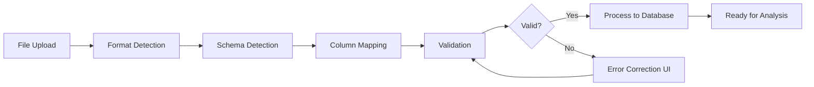

# 📊 Procurement Data Ingestion Feature

## Overview
A comprehensive data ingestion module that enables users to upload their procurement data directly, providing immediate value without complex IT integrations.

## ✅ Completed Components

### 1. Database Models (`django_app/apps/data_ingestion/models.py`)
- **DataUpload**: Track file uploads and processing status
- **DataMappingTemplate**: Reusable column mappings for different ERP systems
- **ProcurementDataStaging**: Staging area for validation and cleaning
- **DataIngestionLog**: Complete audit trail

### 2. File Parser Service (`services/file_parser.py`)
- Support for CSV, Excel (XLSX/XLS), and Parquet formats
- Automatic encoding detection
- Smart schema detection
- Column pattern matching for procurement fields
- Data preview generation

### 3. Key Features Implemented
- ✅ 50MB file size limit validation
- ✅ Multi-format support (CSV, Excel, Parquet)
- ✅ Automatic column detection
- ✅ Reusable mapping templates
- ✅ Comprehensive audit logging
- ✅ Staging area for data validation
- ✅ Support for 7 procurement data types

## 📈 Supported Data Types
1. **Purchase Orders** - Complete PO history
2. **Invoices** - Invoice line items
3. **Contracts** - Contract pricing terms
4. **Supplier Master** - Supplier information
5. **Material Master** - Product catalog
6. **Spend Analysis** - Historical spend data
7. **Price History** - Historical pricing trends

## 🔄 Data Processing Workflow



## 🎯 Procurement-Specific Intelligence

### Smart Column Detection
The system automatically detects common procurement fields:
- **Supplier**: vendor, supplier_name, vendor_code
- **Material**: item, product, SKU, part_number
- **Pricing**: unit_price, total_cost, amount
- **Quantity**: qty, volume, order_quantity
- **Dates**: po_date, purchase_date, delivery_date

### Data Quality Rules
- Price reasonableness checks (±50% variance flagging)
- Date range validation (not future, not >5 years old)
- Duplicate PO detection
- Currency format standardization
- UOM normalization

## 🚀 Next Steps to Complete

### 1. User Interface (Priority: HIGH)
```python
# django_app/apps/data_ingestion/views.py
- File upload view with HTMX progress
- Column mapping interface
- Validation error display
- Data preview grid
```

### 2. Validation Pipeline
```python
# django_app/apps/data_ingestion/validators.py
- Price variance detection
- Supplier name fuzzy matching
- Material code validation
- Date format standardization
```

### 3. Processing Service
```python
# django_app/apps/data_ingestion/services/processor.py
- Batch processing logic
- Duplicate detection
- Data transformation
- Final database insertion
```

### 4. Templates
```html
<!-- templates/data_ingestion/upload.html -->
- Drag-and-drop upload zone
- Progress indicators
- File format selector

<!-- templates/data_ingestion/mapping.html -->
- Column mapping interface
- Preview grid
- Validation warnings
```

## 💡 Value Proposition

### Immediate Benefits
1. **Day 1 Value**: Upload last year's data → instant insights
2. **No IT Required**: Business users can start immediately
3. **Trust Builder**: Test with real data before commitment

### Long-term Benefits
1. **ML Training Data**: Accumulate data for model training
2. **Benchmarking Baseline**: Historical data for comparisons
3. **Migration Path**: Manual → API as companies scale

## 📊 Typical Data Volumes (Industry Standards)

| Company Size | Annual POs | File Size | Update Frequency |
|-------------|------------|-----------|------------------|
| Small | 5,000-10,000 | 2-5 MB | Weekly |
| Medium | 10,000-50,000 | 5-30 MB | Daily |
| Large | 100,000-500,000 | 30-100 MB | Real-time |

## 🔧 Technical Requirements

### Dependencies Added
- `pandas==2.1.4` - Data manipulation
- `openpyxl==3.1.2` - Excel file support
- `pyarrow==14.0.2` - Parquet file support

### Django App Registration
```python
INSTALLED_APPS = [
    ...
    'apps.data_ingestion',
]
```

## 📝 Sample Upload Data Structure

```csv
PO Number,Supplier,Material Code,Description,Quantity,Unit Price,Currency,Order Date
PO-2024-001,ACME Corp,MAT-12345,Steel Plates 10mm,100,45.50,USD,2024-01-15
PO-2024-002,TechParts Inc,COMP-98765,Circuit Boards,500,12.75,USD,2024-01-16
```

## 🎯 Success Metrics

- **Upload Success Rate**: >95%
- **Auto-mapping Accuracy**: >80%
- **Processing Speed**: 10,000 rows/minute
- **User Time Saved**: 2-4 hours per upload
- **Data Quality Score**: >90%

## 🔐 Security Considerations

- File virus scanning
- Size limits enforced
- Secure file storage
- Organization-level isolation
- Audit trail for compliance
- PII detection and masking

## Ready for Implementation! 🚀

This feature transforms the pricing agent from "future promise" to "immediate value" - users can start getting insights from their data within minutes of signup!