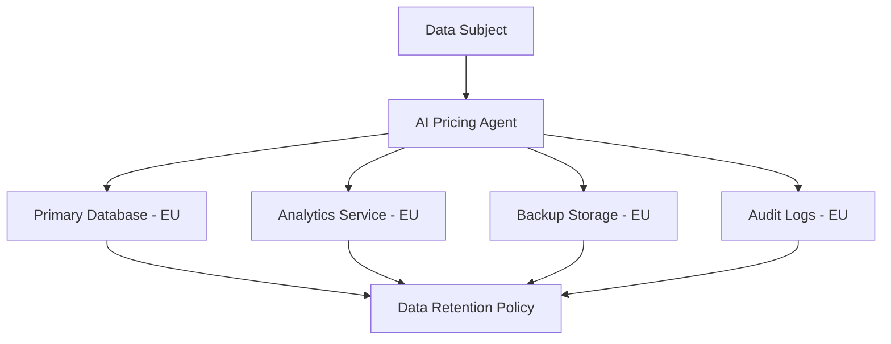

# GDPR Compliance Documentation
## AI Pricing Agent System

**Document Version:** 1.0  
**Last Updated:** {{ current_date }}  
**Document Owner:** Data Protection Officer  
**Review Cycle:** Annual  

---

## 1. Executive Summary

This document outlines how the AI Pricing Agent system complies with the General Data Protection Regulation (EU) 2016/679 (GDPR). The system is designed with privacy-by-design principles and implements comprehensive data protection measures.

### 1.1 Compliance Status
- **GDPR Compliance Assessment:** ✅ Compliant
- **Last Privacy Impact Assessment:** {{ last_pia_date }}
- **Next Compliance Review:** {{ next_review_date }}

## 2. Data Controller Information

**Legal Entity:** {{ company_name }}  
**Address:** {{ company_address }}  
**Data Protection Officer:** {{ dpo_name }}  
**Contact Email:** {{ dpo_email }}  
**Phone:** {{ dpo_phone }}  

## 3. Legal Basis for Processing (Article 6)

### 3.1 Personal Data Processing Purposes

| Purpose | Legal Basis | Data Categories | Retention Period |
|---------|-------------|-----------------|------------------|
| User Authentication | Legitimate Interest | Identity data, credentials | Account lifetime + 30 days |
| Service Delivery | Contract Performance | Profile data, usage data | Contract term + 7 years |
| Security Monitoring | Legitimate Interest | Access logs, IP addresses | 90 days |
| Analytics | Consent | Usage statistics | 2 years |
| Legal Compliance | Legal Obligation | All relevant data | As required by law |

### 3.2 Special Categories of Personal Data
The system does not process special categories of personal data as defined in Article 9 GDPR.

## 4. Data Subject Rights Implementation

### 4.1 Right of Access (Article 15)
- **Implementation:** Automated data export via `/api/v1/privacy/export/`
- **Response Time:** Within 30 days
- **Format:** JSON format with all personal data
- **Verification:** Multi-factor authentication required

### 4.2 Right to Rectification (Article 16)
- **Implementation:** User profile management interface
- **Automated Updates:** Real-time data synchronization
- **Notification:** Data subjects notified of updates within 24 hours

### 4.3 Right to Erasure (Article 17)
- **Implementation:** Automated anonymization process
- **Exceptions Checked:** Legal obligations, contract requirements
- **Process:** 
  1. Identity verification
  2. Exception assessment
  3. Data anonymization (not deletion to maintain referential integrity)
  4. Confirmation notification

### 4.4 Right to Restrict Processing (Article 18)
- **Implementation:** Processing restriction flags in user security settings
- **Effect:** Data marked for restriction is not processed for primary purposes
- **Notification:** All data processors notified within 24 hours

### 4.5 Right to Data Portability (Article 20)
- **Implementation:** Structured data export in JSON format
- **Scope:** User-provided data and derived data
- **Security:** Encrypted transmission, authentication required

### 4.6 Right to Object (Article 21)
- **Implementation:** Objection processing flags
- **Marketing:** Opt-out mechanisms for all marketing communications
- **Profiling:** Opt-out available for automated decision-making

## 5. Privacy by Design and by Default (Article 25)

### 5.1 Technical Measures
- **Data Minimization:** Only necessary data collected
- **Purpose Limitation:** Data used only for specified purposes
- **Storage Limitation:** Automated data retention policies
- **Accuracy:** Real-time data validation and correction
- **Integrity and Confidentiality:** End-to-end encryption

### 5.2 Organizational Measures
- **Staff Training:** Annual GDPR training for all staff
- **Access Controls:** Role-based access with principle of least privilege
- **Audit Procedures:** Continuous compliance monitoring
- **Incident Response:** 72-hour breach notification procedures

## 6. Data Processing Activities

### 6.1 Data Processing Register

| Activity | Controller | Processor | Data Subjects | Categories | Purpose | Recipients | Transfers | Retention |
|----------|------------|-----------|---------------|------------|---------|------------|-----------|-----------|
| User Management | {{ company_name }} | Internal | Platform Users | Identity, Contact | Service Provision | Internal Staff | None | Account + 30 days |
| Analytics | {{ company_name }} | Internal | Platform Users | Usage Data | Service Improvement | Analytics Team | None | 2 years |
| Security Monitoring | {{ company_name }} | External | All Users | Technical Data | Security | SOC Provider | EU/US | 90 days |

### 6.2 Data Flows

## 7. International Data Transfers

### 7.1 Transfer Mechanisms
- **Primary:** Processing within EU/EEA only
- **Backup Transfers:** Standard Contractual Clauses (SCCs) 2021
- **Adequacy Decisions:** UK (adequacy decision), Switzerland (adequacy decision)

### 7.2 Safeguards
- **Encryption:** All data encrypted in transit and at rest
- **Access Controls:** EU-based access controls
- **Audit Trail:** All access logged and monitored
- **Contractual Protection:** Processor agreements with GDPR clauses

## 8. Data Security Measures (Article 32)

### 8.1 Technical Safeguards
- **Encryption:** AES-256 encryption at rest, TLS 1.3 in transit
- **Access Control:** Multi-factor authentication, role-based access
- **Network Security:** Firewalls, intrusion detection, VPN access
- **Application Security:** Security headers, input validation, output encoding

### 8.2 Organizational Safeguards
- **Staff Training:** Security awareness training program
- **Background Checks:** All staff undergo security clearance
- **Access Management:** Regular access reviews, automated deprovisioning
- **Incident Response:** 24/7 monitoring, incident response team

### 8.3 Data Breach Procedures
1. **Detection:** Automated monitoring and alerting (< 1 hour)
2. **Assessment:** Risk assessment and containment (< 4 hours)
3. **Notification:** DPA notification within 72 hours if required
4. **Communication:** Data subject notification if high risk (< 72 hours)
5. **Documentation:** Incident register and lessons learned

## 9. Data Protection Impact Assessments (Article 35)

### 9.1 DPIA Triggers
- New data processing activities
- High-risk processing operations
- Systematic monitoring
- Large-scale processing of special categories

### 9.2 DPIA Process
1. **Screening:** Risk assessment questionnaire
2. **Full DPIA:** If high-risk identified
3. **Consultation:** DPO involvement mandatory
4. **DPA Consultation:** If residual high risk remains
5. **Review:** Annual DPIA reviews

### 9.3 Current DPIAs
- **User Profiling DPIA:** Completed {{ dpia_date_1 }} - Low Risk
- **Analytics Processing DPIA:** Completed {{ dpia_date_2 }} - Low Risk

## 10. Consent Management

### 10.1 Consent Requirements
- **Freely Given:** Clear opt-in mechanisms
- **Specific:** Granular consent options
- **Informed:** Clear privacy notices
- **Unambiguous:** Explicit consent actions required

### 10.2 Consent Records
- **Storage:** Encrypted consent records with timestamp
- **Proof:** WHO, WHAT, WHEN, WHERE, HOW recorded
- **Withdrawal:** One-click consent withdrawal
- **Granular Control:** Category-specific consent management

### 10.3 Marketing Consent
- **Double Opt-in:** Email verification required
- **Preferences:** Granular marketing preferences
- **Suppression:** Automatic suppression list management

## 11. Vendor and Processor Management

### 11.1 Processor Selection Criteria
- **GDPR Compliance:** Demonstrated GDPR compliance program
- **Security Certifications:** ISO 27001, SOC 2 Type II
- **Contractual Terms:** Article 28 compliant processor agreements
- **Audit Rights:** Right to audit processor compliance

### 11.2 Current Processors

| Processor | Service | Location | Safeguards | Contract Date | Review Date |
|-----------|---------|----------|------------|---------------|-------------|
| AWS EU | Cloud Infrastructure | Ireland | ISO 27001, SCCs | {{ aws_contract_date }} | {{ aws_review_date }} |
| CloudFlare | CDN/Security | EU | Privacy Shield successor | {{ cf_contract_date }} | {{ cf_review_date }} |

## 12. Training and Awareness

### 12.1 Training Program
- **Mandatory Training:** Annual GDPR training for all staff
- **Role-Specific Training:** Data handlers, developers, support staff
- **Regular Updates:** Quarterly compliance updates
- **Testing:** Compliance knowledge assessments

### 12.2 Awareness Initiatives
- **Privacy Champions:** Department privacy representatives
- **Regular Communications:** Monthly privacy updates
- **Incident Simulations:** Quarterly breach response drills

## 13. Compliance Monitoring

### 13.1 Regular Audits
- **Internal Audits:** Quarterly compliance reviews
- **External Audits:** Annual third-party privacy audits
- **Automated Monitoring:** Continuous compliance monitoring
- **Metrics Tracking:** KPIs for privacy compliance

### 13.2 Key Performance Indicators

| KPI | Target | Current | Status |
|-----|--------|---------|--------|
| DSR Response Time | < 30 days | {{ current_dsr_time }} | ✅ |
| Breach Notification Time | < 72 hours | {{ current_breach_time }} | ✅ |
| Staff Training Completion | 100% | {{ training_completion }}% | ✅ |
| Privacy Impact Assessments | 100% coverage | {{ pia_coverage }}% | ✅ |

## 14. Incident Response Procedures

### 14.1 Data Breach Response Plan
1. **Immediate Response (0-1 hour):**
   - Incident detection and initial containment
   - Incident commander designation
   - Initial risk assessment

2. **Assessment Phase (1-4 hours):**
   - Detailed impact assessment
   - Risk evaluation for data subjects
   - Containment and eradication measures

3. **Notification Phase (4-72 hours):**
   - DPA notification if required
   - Data subject notification if high risk
   - Internal stakeholder communication

4. **Recovery Phase:**
   - System restoration
   - Additional safeguards implementation
   - Incident documentation and lessons learned

### 14.2 Communication Templates
- **DPA Notification Template:** Standardized breach notification form
- **Data Subject Notification:** Clear, non-technical breach notification
- **Internal Communication:** Incident status and response actions

## 15. Documentation and Records

### 15.1 Required Records (Article 30)
- **Processing Activities Register:** Maintained and updated quarterly
- **Consent Records:** Individual consent with timestamp and method
- **Data Subject Requests:** Log of all DSRs and responses
- **Breach Register:** All incidents regardless of notification requirement
- **DPIA Register:** All completed privacy impact assessments

### 15.2 Document Retention
- **Legal Documents:** Indefinite retention
- **Operational Records:** 7 years
- **Training Records:** 3 years after staff departure
- **Audit Records:** 7 years

## 16. Contact Information

### 16.1 Data Protection Officer
**Name:** {{ dpo_name }}  
**Email:** {{ dpo_email }}  
**Phone:** {{ dpo_phone }}  
**Office Hours:** {{ dpo_hours }}  

### 16.2 Data Subject Rights Requests
**Email:** privacy@{{ company_domain }}  
**Online Portal:** {{ privacy_portal_url }}  
**Response Time:** Within 30 days  

### 16.3 Supervisory Authority
**Authority:** {{ supervisory_authority }}  
**Address:** {{ sa_address }}  
**Phone:** {{ sa_phone }}  
**Website:** {{ sa_website }}  

---

## Document Control

| Version | Date | Author | Changes |
|---------|------|--------|---------|
| 1.0 | {{ current_date }} | {{ document_author }} | Initial version |

**Next Review Date:** {{ next_review_date }}  
**Document Classification:** Internal  
**Approval:** {{ approver_name }}, {{ approver_title }}  

---

*This document contains confidential and proprietary information. Distribution is restricted to authorized personnel only.*