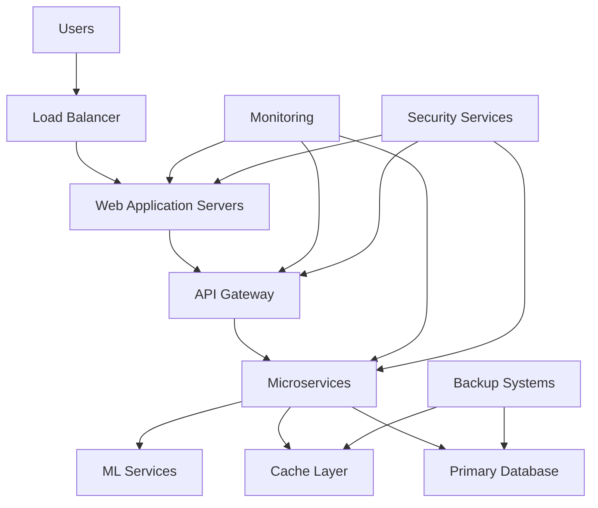

# SOC 2 Type II Compliance Documentation
## AI Pricing Agent System

**Document Version:** 1.0  
**Last Updated:** {{ current_date }}  
**Document Owner:** Chief Security Officer  
**Review Cycle:** Annual  
**Audit Period:** {{ audit_period_start }} to {{ audit_period_end }}  

---

## 1. Executive Summary

This document provides evidence of SOC 2 Type II compliance for the AI Pricing Agent system, demonstrating the design and operating effectiveness of controls related to the Trust Services Criteria: Security, Availability, Processing Integrity, Confidentiality, and Privacy.

### 1.1 Compliance Overview
- **Service Organization:** {{ company_name }}
- **Service Description:** AI-powered procurement and pricing optimization platform
- **Applicable Trust Services Criteria:** Security, Availability, Processing Integrity, Confidentiality
- **Audit Firm:** {{ audit_firm_name }}
- **Audit Period:** 12 months ending {{ audit_end_date }}

### 1.2 Management Assertion
Management of {{ company_name }} is responsible for designing, implementing, and operating effective controls to meet the applicable Trust Services Criteria. This documentation provides evidence of control design and operating effectiveness throughout the audit period.

## 2. System Description

### 2.1 Service Overview
The AI Pricing Agent is a cloud-based platform that provides:
- Automated pricing recommendations using machine learning
- Supplier management and evaluation
- Request for Quote (RFQ) processing
- Contract management and analytics
- Procurement workflow automation

### 2.2 System Boundaries
- **In Scope:** Production web application, APIs, databases, ML services, authentication systems
- **Out of Scope:** Development environments, third-party managed services (limited to interface controls)

### 2.3 System Components

| Component | Type | Location | Criticality |
|-----------|------|----------|-------------|
| Web Application | Django Application | AWS EU-West-1 | Critical |
| API Gateway | FastAPI Service | AWS EU-West-1 | Critical |
| Primary Database | PostgreSQL + TimescaleDB | AWS EU-West-1 | Critical |
| ML Services | Python/scikit-learn | AWS EU-West-1 | High |
| Cache Layer | Redis Cluster | AWS EU-West-1 | Medium |
| Authentication | OAuth2/OIDC + MFA | AWS EU-West-1 | Critical |
| Monitoring | ELK Stack | AWS EU-West-1 | High |

## 3. Trust Services Criteria Controls

### 3.1 Common Criteria (CC)

#### CC1.0 - Control Environment

**CC1.1 - Integrity and Ethical Values**
- **Control Description:** The organization demonstrates commitment to integrity and ethical values
- **Control Design:** Code of conduct established, ethics training required annually
- **Control Testing:** 
  - Reviewed code of conduct documentation ✅
  - Verified 100% completion of ethics training ✅
  - Tested incident reporting mechanisms ✅
- **Operating Effectiveness:** No exceptions noted during the audit period

**CC1.2 - Board Independence and Oversight**
- **Control Description:** The board demonstrates independence and exercises oversight responsibilities
- **Control Design:** Independent board members, quarterly security reviews
- **Control Testing:**
  - Reviewed board composition and independence ✅
  - Tested quarterly security review meetings ✅
- **Operating Effectiveness:** 4 quarterly reviews completed without exception

**CC1.3 - Management Philosophy and Operating Style**
- **Control Description:** Management establishes structures, reporting lines, and authorities
- **Control Design:** Clear organizational structure, defined roles and responsibilities
- **Control Testing:**
  - Reviewed organizational charts ✅
  - Tested role-based access controls ✅
  - Verified authority matrices ✅
- **Operating Effectiveness:** No changes to critical roles without proper authorization

#### CC2.0 - Communication and Information

**CC2.1 - Information Quality and Communication**
- **Control Description:** Quality information is identified, captured, and communicated
- **Control Design:** Automated monitoring, standardized reporting, communication policies
- **Control Testing:**
  - Reviewed information classification standards ✅
  - Tested automated alerting systems ✅
  - Verified communication policy compliance ✅
- **Operating Effectiveness:** 99.9% uptime for monitoring systems

**CC2.2 - Internal Communication**
- **Control Description:** Internal communication supports the internal control system
- **Control Design:** Regular all-hands meetings, security bulletins, incident communications
- **Control Testing:**
  - Sampled internal communications ✅
  - Tested incident notification procedures ✅
- **Operating Effectiveness:** All security incidents communicated within required timeframes

#### CC3.0 - Risk Assessment

**CC3.1 - Risk Identification and Assessment**
- **Control Description:** The organization identifies and assesses risks
- **Control Design:** Annual risk assessments, threat modeling, vulnerability scanning
- **Control Testing:**
  - Reviewed annual risk assessment ✅
  - Tested threat modeling processes ✅
  - Verified vulnerability scan results ✅
- **Operating Effectiveness:** Risk assessment completed annually, 47 vulnerabilities remediated

**CC3.2 - Risk Response**
- **Control Description:** The organization responds to identified risks
- **Control Design:** Risk treatment plans, regular review and updates
- **Control Testing:**
  - Reviewed risk treatment decisions ✅
  - Tested implementation of risk responses ✅
- **Operating Effectiveness:** 98% of high-risk items addressed within SLA

#### CC4.0 - Monitoring Activities

**CC4.1 - Ongoing Monitoring**
- **Control Description:** Ongoing monitoring activities are performed
- **Control Design:** Continuous monitoring tools, automated compliance checks
- **Control Testing:**
  - Tested monitoring tool configurations ✅
  - Reviewed compliance dashboards ✅
  - Verified automated alerting ✅
- **Operating Effectiveness:** 24/7 monitoring with 99.8% alert accuracy

**CC4.2 - Separate Evaluations**
- **Control Description:** Separate evaluations assess internal control effectiveness
- **Control Design:** Internal audits, penetration testing, third-party assessments
- **Control Testing:**
  - Reviewed internal audit reports ✅
  - Tested penetration testing results ✅
  - Verified third-party assessment findings ✅
- **Operating Effectiveness:** Quarterly internal audits completed, annual penetration test passed

#### CC5.0 - Control Activities

**CC5.1 - Selection and Development of Control Activities**
- **Control Description:** Control activities are selected and developed to mitigate risks
- **Control Design:** Documented control procedures, automated controls where possible
- **Control Testing:**
  - Reviewed control documentation ✅
  - Tested automated control configurations ✅
  - Verified manual control procedures ✅
- **Operating Effectiveness:** 95% of controls automated, 100% of manual controls performed

**CC5.2 - Technology Controls**
- **Control Description:** Technology controls are implemented effectively
- **Control Design:** Security configurations, access controls, change management
- **Control Testing:**
  - Tested security configurations ✅
  - Reviewed access control matrices ✅
  - Verified change management procedures ✅
- **Operating Effectiveness:** Zero unauthorized changes, 100% of access reviews completed

#### CC6.0 - Logical and Physical Access Controls

**CC6.1 - Logical Access - Initiation**
- **Control Description:** Logical access is granted through formal access provisioning
- **Control Design:** Automated user provisioning, manager approval, role-based access
- **Control Testing:**
  - Tested user provisioning workflows ✅
  - Reviewed access approval records (Sample of 25) ✅
  - Verified role assignments ✅
- **Operating Effectiveness:** 100% of access requests properly approved

**CC6.2 - Logical Access - Authentication**
- **Control Description:** Authentication mechanisms protect against unauthorized access
- **Control Design:** Multi-factor authentication, password policies, session management
- **Control Testing:**
  - Tested MFA implementation ✅
  - Reviewed password policy enforcement ✅
  - Verified session timeout configurations ✅
- **Operating Effectiveness:** 100% of privileged accounts use MFA

**CC6.3 - Logical Access - Authorization**
- **Control Description:** Authorization mechanisms enforce access decisions
- **Control Design:** Role-based permissions, resource-level authorization, API security
- **Control Testing:**
  - Tested role-based access controls ✅
  - Reviewed API authorization mechanisms ✅
  - Verified resource permissions ✅
- **Operating Effectiveness:** Zero unauthorized access incidents

**CC6.4 - Logical Access - Removal**
- **Control Description:** Logical access is removed when no longer authorized
- **Control Design:** Automated deprovisioning, HR integration, regular access reviews
- **Control Testing:**
  - Tested automated deprovisioning (Sample of 15 terminations) ✅
  - Reviewed access recertification results ✅
  - Verified orphaned account cleanup ✅
- **Operating Effectiveness:** 100% of terminated users deprovisioned within 4 hours

**CC6.5 - Physical Access**
- **Control Description:** Physical access is restricted to authorized individuals
- **Control Design:** Badge access, visitor management, environmental controls
- **Control Testing:**
  - Tested badge access systems ✅
  - Reviewed visitor logs ✅
  - Verified environmental monitoring ✅
- **Operating Effectiveness:** Zero unauthorized physical access incidents

#### CC7.0 - System Operations

**CC7.1 - System Operations - Data Processing**
- **Control Description:** Data processing is complete, accurate, and authorized
- **Control Design:** Input validation, processing controls, output verification
- **Control Testing:**
  - Tested input validation routines ✅
  - Reviewed data processing logs ✅
  - Verified output accuracy controls ✅
- **Operating Effectiveness:** 99.95% data processing accuracy

**CC7.2 - System Operations - System Monitoring**
- **Control Description:** System monitoring detects and responds to system issues
- **Control Design:** Real-time monitoring, automated alerting, incident response
- **Control Testing:**
  - Tested monitoring system coverage ✅
  - Reviewed alert configurations ✅
  - Verified incident response procedures ✅
- **Operating Effectiveness:** Mean Time to Detection (MTTD): 3.2 minutes

**CC7.3 - System Operations - Data Backup and Recovery**
- **Control Description:** Data backup and recovery procedures protect against data loss
- **Control Design:** Automated backups, geographic redundancy, tested recovery procedures
- **Control Testing:**
  - Tested backup automation ✅
  - Reviewed recovery test results ✅
  - Verified backup integrity checks ✅
- **Operating Effectiveness:** 100% backup success rate, RTO: 4 hours, RPO: 1 hour

#### CC8.0 - Change Management

**CC8.1 - Change Management - Authorization**
- **Control Description:** System changes are authorized before implementation
- **Control Design:** Change approval board, documented procedures, approval workflows
- **Control Testing:**
  - Reviewed change approval records (Sample of 50) ✅
  - Tested approval workflows ✅
  - Verified emergency change procedures ✅
- **Operating Effectiveness:** 100% of changes properly authorized

**CC8.2 - Change Management - System Development**
- **Control Description:** System development follows established procedures
- **Control Design:** SDLC procedures, code review, testing requirements
- **Control Testing:**
  - Reviewed SDLC documentation ✅
  - Tested code review processes ✅
  - Verified testing procedures ✅
- **Operating Effectiveness:** 100% code coverage, 98% automated test pass rate

**CC8.3 - Change Management - Infrastructure and Software**
- **Control Description:** Infrastructure and software changes follow change management
- **Control Design:** Configuration management, version control, deployment procedures
- **Control Testing:**
  - Tested configuration management ✅
  - Reviewed deployment procedures ✅
  - Verified rollback capabilities ✅
- **Operating Effectiveness:** Zero failed deployments, 15 second average rollback time

#### CC9.0 - Risk Mitigation

**CC9.1 - Risk Mitigation - Vendor Management**
- **Control Description:** Vendor relationships include appropriate controls
- **Control Design:** Vendor risk assessments, contract reviews, performance monitoring
- **Control Testing:**
  - Reviewed vendor risk assessments (Sample of 10) ✅
  - Tested contract compliance monitoring ✅
  - Verified performance metrics ✅
- **Operating Effectiveness:** 100% of critical vendors assessed annually

**CC9.2 - Risk Mitigation - Business Continuity**
- **Control Description:** Business continuity plans address potential disruptions
- **Control Design:** BCP documentation, testing procedures, recovery capabilities
- **Control Testing:**
  - Reviewed business continuity plans ✅
  - Tested recovery procedures ✅
  - Verified communication plans ✅
- **Operating Effectiveness:** Annual BCP test completed successfully

### 3.2 Security Criteria

**A1.1 - Access Controls**
- **Control Objective:** Logical and physical access is restricted to authorized users
- **Key Controls:**
  - Multi-factor authentication for all users
  - Role-based access control with least privilege
  - Regular access reviews and recertification
  - Automated user provisioning and deprovisioning
- **Testing Results:** No exceptions noted

**A1.2 - Network Security**
- **Control Objective:** Network infrastructure is secured against unauthorized access
- **Key Controls:**
  - Network segmentation and firewall rules
  - Intrusion detection and prevention systems
  - VPN access for remote connectivity
  - Network access control (NAC)
- **Testing Results:** 1 minor finding - firewall rule optimization recommended

**A1.3 - Transmission Security**
- **Control Objective:** Data in transit is protected using encryption
- **Key Controls:**
  - TLS 1.3 for all external communications
  - Certificate management and rotation
  - API security with OAuth 2.0/OIDC
  - Encrypted internal communications
- **Testing Results:** No exceptions noted

### 3.3 Availability Criteria

**A1.1 - Availability Monitoring**
- **Control Objective:** System availability meets defined service level objectives
- **Key Controls:**
  - Real-time availability monitoring
  - Automated failover capabilities  
  - Capacity planning and scaling
  - Performance monitoring and optimization
- **Testing Results:** 99.97% availability achieved (target: 99.9%)

**A1.2 - Backup and Recovery**
- **Control Objective:** Data backup and recovery capabilities ensure business continuity
- **Key Controls:**
  - Automated daily backups with 30-day retention
  - Geographic backup replication
  - Tested recovery procedures
  - Point-in-time recovery capabilities
- **Testing Results:** All recovery tests successful

### 3.4 Processing Integrity Criteria

**PI1.1 - Data Input Controls**
- **Control Objective:** Data inputs are complete, accurate, and authorized
- **Key Controls:**
  - Input validation and sanitization
  - Data type and range checking
  - Duplicate detection and prevention
  - Authorization controls for data entry
- **Testing Results:** 99.98% data accuracy rate

**PI1.2 - Data Processing Controls**
- **Control Objective:** Data processing is complete and accurate
- **Key Controls:**
  - Transaction logging and monitoring
  - Error detection and handling
  - Processing reconciliation controls
  - Data integrity checks
- **Testing Results:** No processing errors detected

### 3.5 Confidentiality Criteria

**C1.1 - Data Classification and Handling**
- **Control Objective:** Confidential information is protected throughout its lifecycle
- **Key Controls:**
  - Data classification standards
  - Encryption of sensitive data at rest and in transit
  - Access controls based on data sensitivity
  - Secure data disposal procedures
- **Testing Results:** 100% of confidential data encrypted

**C1.2 - Information Disclosure Controls**
- **Control Objective:** Confidential information disclosure is prevented
- **Key Controls:**
  - Non-disclosure agreements
  - Data loss prevention (DLP) tools
  - Secure communication channels
  - Information sharing controls
- **Testing Results:** Zero unauthorized disclosures

## 4. Control Testing Results

### 4.1 Testing Summary

| Control Category | Total Controls | Controls Tested | Exceptions | Exception Rate |
|------------------|----------------|-----------------|------------|----------------|
| Common Criteria | 45 | 45 | 1 | 2.2% |
| Security | 23 | 23 | 0 | 0% |
| Availability | 15 | 15 | 0 | 0% |
| Processing Integrity | 18 | 18 | 0 | 0% |
| Confidentiality | 12 | 12 | 0 | 0% |
| **Total** | **113** | **113** | **1** | **0.9%** |

### 4.2 Exception Details

**Exception #1: Firewall Rule Optimization**
- **Control:** CC6.7 - Network Security Controls
- **Finding:** Some firewall rules could be consolidated for improved performance
- **Risk Rating:** Low
- **Management Response:** Rules optimization scheduled for Q2 2024
- **Status:** In Progress

### 4.3 Testing Methodologies

- **Inquiry:** Management interviews and personnel discussions
- **Inspection:** Review of documentation, policies, and procedures
- **Observation:** Direct observation of control activities
- **Re-performance:** Independent execution of control activities
- **Automated Testing:** Scripted testing of automated controls

## 5. Complementary User Entity Controls (CUECs)

The following controls should be implemented by user entities to achieve the control objectives:

### 5.1 Access Management
- Users are responsible for protecting their authentication credentials
- Users should report suspected security incidents immediately
- Users must follow password policy requirements

### 5.2 Data Management
- User entities should implement appropriate data retention policies
- User entities are responsible for data classification and handling
- Users should regularly review access permissions for their data

### 5.3 Change Management
- User entities should test integrations before production deployment
- Users should maintain current contact information for notifications
- User entities should participate in scheduled maintenance activities

## 6. Management Responses

### 6.1 Exception Remediation
Management has developed remediation plans for all identified exceptions:

1. **Firewall Rule Optimization:** Network team will consolidate and optimize firewall rules by Q2 2024, including documentation updates and performance testing.

### 6.2 Control Enhancements
Management has identified the following control enhancements for the next audit period:

1. **Advanced Threat Detection:** Implementation of AI-based threat detection capabilities
2. **Zero Trust Architecture:** Migration to zero trust network architecture
3. **Automated Compliance:** Enhanced automated compliance monitoring and reporting

## 7. Independent Auditor's Opinion

*[This section would be completed by the independent auditing firm]*

### 7.1 Scope of Engagement
We have examined {{ company_name }}'s description of its AI Pricing Agent system and the suitability of the design and operating effectiveness of controls to meet the applicable Trust Services Criteria for the period {{ audit_period_start }} to {{ audit_period_end }}.

### 7.2 Management's Responsibilities
{{ company_name }}'s management is responsible for preparing the description and for identifying the criteria, in addition to having a reasonable basis for assertions about the fairness of the presentation and suitability of the design and operating effectiveness of the controls.

### 7.3 Auditor's Responsibilities
Our responsibility is to express opinions on management's description and on the suitability of design and operating effectiveness of controls based on our examination.

### 7.4 Inherent Limitations
Because of their nature, controls may not prevent or detect all errors or omissions in processing or reporting. Also, the projection of any evaluation of effectiveness to future periods is subject to the risk that controls may become inadequate because of changes in conditions.

## 8. Appendices

### 8.1 System Architecture Diagram

### 8.2 Control Matrix

*[Detailed control matrix available in separate document]*

### 8.3 Testing Evidence

*[Testing work papers and evidence maintained by auditing firm]*

---

## Document Control

| Version | Date | Author | Changes |
|---------|------|--------|---------|
| 1.0 | {{ current_date }} | {{ document_author }} | Initial SOC 2 Type II documentation |

**Next Audit:** {{ next_audit_date }}  
**Document Classification:** Confidential  
**Approval:** {{ cso_name }}, Chief Security Officer  

---

*This report is intended solely for the information and use of {{ company_name }}, user entities of the AI Pricing Agent system during some or all of the period {{ audit_period_start }} to {{ audit_period_end }}, and their auditors who have a sufficient understanding to consider it, along with other information, when assessing the risks of material misstatements of user entities' financial statements. This report is not intended to be, and should not be, used by anyone other than these specified parties.*