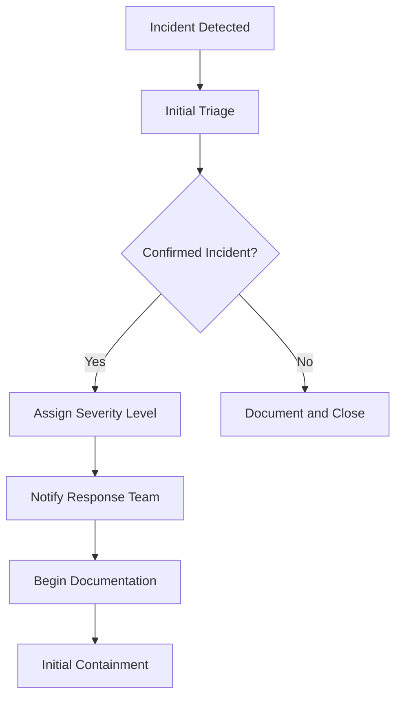

# Incident Response Playbook
## AI Pricing Agent System

**Document Version:** 2.0  
**Last Updated:** {{ current_date }}  
**Document Owner:** Chief Security Officer  
**Review Cycle:** Semi-Annual  
**Classification:** CONFIDENTIAL  

---

## 1. Executive Summary

This playbook provides comprehensive procedures for detecting, analyzing, containing, eradicating, and recovering from security incidents affecting the AI Pricing Agent system. It ensures rapid response, minimal impact, and compliance with regulatory requirements.

### 1.1 Objectives
- Minimize business impact and recovery time
- Preserve evidence for investigation and legal proceedings
- Meet regulatory notification requirements
- Continuous improvement of security posture
- Maintain stakeholder confidence and trust

### 1.2 Scope
This playbook applies to all security incidents affecting:
- Production systems and services
- Customer data and privacy
- Intellectual property and trade secrets
- System availability and integrity
- Third-party integrations and services

## 2. Incident Response Team Structure

### 2.1 Core Team Members

| Role | Primary | Backup | Contact |
|------|---------|--------|---------|
| **Incident Commander** | {{ ic_primary_name }} | {{ ic_backup_name }} | {{ ic_contact }} |
| **Security Lead** | {{ sec_primary_name }} | {{ sec_backup_name }} | {{ sec_contact }} |
| **Technical Lead** | {{ tech_primary_name }} | {{ tech_backup_name }} | {{ tech_contact }} |
| **Communications Lead** | {{ comm_primary_name }} | {{ comm_backup_name }} | {{ comm_contact }} |
| **Legal Counsel** | {{ legal_primary_name }} | {{ legal_backup_name }} | {{ legal_contact }} |
| **HR Representative** | {{ hr_primary_name }} | {{ hr_backup_name }} | {{ hr_contact }} |

### 2.2 Extended Team

| Role | Contact | Responsibilities |
|------|---------|------------------|
| **CEO** | {{ ceo_contact }} | Executive decisions, external communications |
| **CTO** | {{ cto_contact }} | Technical architecture decisions |
| **DPO** | {{ dpo_contact }} | Privacy impact assessment, regulatory notifications |
| **External Counsel** | {{ ext_legal_contact }} | Legal advice, regulatory compliance |
| **PR Agency** | {{ pr_contact }} | External communications, media relations |
| **Forensics Partner** | {{ forensics_contact }} | Digital forensics, evidence collection |

### 2.3 Escalation Matrix

| Incident Severity | Auto-Escalation | Manual Escalation |
|-------------------|-----------------|-------------------|
| **P0 - Critical** | CEO, CTO, All Core Team | Board of Directors |
| **P1 - High** | CTO, Core Team | CEO |
| **P2 - Medium** | Security Lead, Technical Lead | CTO |
| **P3 - Low** | Security Analyst | Security Lead |

## 3. Incident Classification and Severity

### 3.1 Incident Types

| Type | Code | Description | Examples |
|------|------|-------------|----------|
| **Data Breach** | DB | Unauthorized access/disclosure of sensitive data | Customer PII exposure, database compromise |
| **System Compromise** | SC | Unauthorized system access or control | Malware infection, account takeover |
| **Service Disruption** | SD | System unavailability or performance degradation | DDoS attack, system failure |
| **Insider Threat** | IT | Malicious or negligent insider activity | Data theft, sabotage |
| **Third-Party** | TP | Security incident involving vendors/partners | Supply chain attack, vendor breach |
| **Physical Security** | PS | Physical security breach | Unauthorized facility access |
| **Social Engineering** | SE | Human-targeted attacks | Phishing, business email compromise |

### 3.2 Severity Levels

#### P0 - CRITICAL (Response Time: 15 minutes)
- **Criteria:**
  - Active data exfiltration or encryption (ransomware)
  - Complete system compromise or unavailability
  - Confirmed unauthorized access to customer data
  - Active attacks with significant business impact
- **Notification:** CEO, CTO, All stakeholders immediately
- **SLA:** 15-minute response, 1-hour containment

#### P1 - HIGH (Response Time: 30 minutes)
- **Criteria:**
  - Suspected data breach requiring regulatory notification
  - Significant system compromise or unavailability
  - Confirmed malware infection
  - Unauthorized access to sensitive systems
- **Notification:** Core incident response team
- **SLA:** 30-minute response, 4-hour containment

#### P2 - MEDIUM (Response Time: 2 hours)
- **Criteria:**
  - Suspicious activity requiring investigation
  - Minor system compromise or performance impact
  - Policy violations with security implications
  - Successful phishing attacks
- **Notification:** Security team and relevant stakeholders
- **SLA:** 2-hour response, 24-hour containment

#### P3 - LOW (Response Time: 8 hours)
- **Criteria:**
  - Security alerts requiring analysis
  - Minor policy violations
  - Failed attack attempts
  - Security awareness incidents
- **Notification:** Security analyst and supervisor
- **SLA:** 8-hour response, 72-hour resolution

## 4. Incident Response Phases

### 4.1 Phase 1: Preparation

#### 4.1.1 Pre-Incident Activities
- [ ] **Team Readiness**
  - Contact information updated and verified
  - Roles and responsibilities clearly defined
  - Training completed and documented
  - Backup personnel identified and trained

- [ ] **Tools and Resources**
  - Incident response tools tested and available
  - Forensic images and analysis tools ready
  - Communication channels established
  - Decision trees and playbooks accessible

- [ ] **Documentation**
  - Incident response plan reviewed and approved
  - Contact lists maintained and current
  - Escalation procedures documented
  - Legal requirements understood and documented

#### 4.1.2 Monitoring and Detection
- **Automated Detection:**
  - SIEM alerts and correlation rules
  - Intrusion detection systems (IDS/IPS)
  - Endpoint detection and response (EDR)
  - Application security monitoring
  - Cloud security monitoring (CloudTrail, GuardDuty)

- **Manual Detection:**
  - Security analyst monitoring
  - User reports and help desk tickets
  - Threat intelligence feeds
  - Vulnerability scan results
  - Third-party notifications

### 4.2 Phase 2: Detection and Analysis

#### 4.2.1 Initial Assessment (0-30 minutes)



**Actions Checklist:**
- [ ] **Incident Confirmation**
  - Verify the incident is legitimate (not false positive)
  - Document initial findings and evidence
  - Assign unique incident ID: INC-YYYY-NNNN
  - Record incident start time

- [ ] **Severity Assessment**
  - Apply severity classification criteria
  - Consider business impact and data sensitivity
  - Assess potential regulatory implications
  - Document severity rationale

- [ ] **Team Notification**
  - Alert appropriate response team members
  - Establish communication channels (Slack, conference bridge)
  - Create incident war room if required
  - Begin incident log documentation

- [ ] **Initial Evidence Collection**
  - Preserve system state and logs
  - Take screenshots of alerts and findings
  - Document affected systems and users
  - Collect initial forensic artifacts

#### 4.2.2 Detailed Analysis (30 minutes - 4 hours)

**Actions Checklist:**
- [ ] **Scope Assessment**
  - Identify all affected systems and data
  - Determine attack timeline and methods
  - Assess data exposure and unauthorized access
  - Map potential lateral movement

- [ ] **Threat Analysis**
  - Identify attack vectors and techniques (MITRE ATT&CK)
  - Analyze malware or attack tools
  - Correlate with threat intelligence feeds
  - Assess threat actor capabilities and intentions

- [ ] **Impact Assessment**
  - Quantify affected users and customers
  - Assess business process disruption
  - Evaluate regulatory and legal implications
  - Calculate potential financial impact

- [ ] **Root Cause Analysis**
  - Identify initial compromise vector
  - Analyze security control failures
  - Document attack progression
  - Identify contributing factors

### 4.3 Phase 3: Containment

#### 4.3.1 Short-term Containment (Immediate - 4 hours)

**Priority Actions:**
- [ ] **Isolate Affected Systems**
  ```bash
  # Network isolation commands
  sudo iptables -A INPUT -j DROP
  sudo iptables -A OUTPUT -j DROP
  
  # AWS security group isolation
  aws ec2 authorize-security-group-ingress --group-id sg-xxxxx --protocol tcp --port 22 --source-group sg-admin-only
  ```

- [ ] **Account Security**
  - Disable compromised user accounts
  - Reset passwords for affected accounts
  - Revoke API keys and access tokens
  - Enable additional MFA requirements

- [ ] **System Protection**
  - Apply emergency patches or configuration changes
  - Deploy additional monitoring or detection rules
  - Implement temporary access restrictions
  - Activate backup systems if needed

- [ ] **Evidence Preservation**
  - Create forensic images of affected systems
  - Preserve volatile memory if possible
  - Collect and secure log files
  - Document chain of custody

#### 4.3.2 Long-term Containment (4-24 hours)

**Sustained Actions:**
- [ ] **System Hardening**
  - Deploy additional security controls
  - Implement network segmentation
  - Enhance monitoring and alerting
  - Update security configurations

- [ ] **Process Improvements**
  - Implement additional approval workflows
  - Enhance change management controls
  - Strengthen access controls
  - Improve monitoring coverage

### 4.4 Phase 4: Eradication

#### 4.4.1 Threat Removal (1-7 days)

**Actions Checklist:**
- [ ] **Malware Removal**
  - Remove malicious software from all systems
  - Clean infected files and registry entries
  - Verify complete removal with multiple tools
  - Update anti-malware signatures

- [ ] **Account Cleanup**
  - Remove unauthorized accounts and access
  - Revoke compromised certificates
  - Update compromised passwords and keys
  - Remove backdoors and persistent access

- [ ] **System Restoration**
  - Restore systems from clean backups
  - Rebuild compromised systems from scratch
  - Apply all security patches and updates
  - Reconfigure security controls

- [ ] **Vulnerability Remediation**
  - Fix vulnerabilities that enabled the attack
  - Apply security patches and updates
  - Implement additional security controls
  - Update security configurations

#### 4.4.2 Verification (1-3 days)

**Validation Steps:**
- [ ] **System Validation**
  - Verify systems are clean and secure
  - Confirm all malicious artifacts removed
  - Test system functionality and performance
  - Validate security control effectiveness

- [ ] **Security Testing**
  - Conduct vulnerability scans
  - Perform penetration testing if needed
  - Test incident response improvements
  - Verify monitoring and detection capabilities

### 4.5 Phase 5: Recovery

#### 4.5.1 System Restoration (1-3 days)

**Actions Checklist:**
- [ ] **Gradual Restoration**
  - Restore systems in phases with monitoring
  - Validate each system before full restoration
  - Monitor for signs of re-infection
  - Maintain enhanced monitoring

- [ ] **User Communication**
  - Notify users of service restoration
  - Provide security guidance and updates
  - Address user concerns and questions
  - Update status pages and communications

- [ ] **Business Continuity**
  - Resume normal business operations
  - Validate critical business processes
  - Monitor performance and stability
  - Address any residual issues

#### 4.5.2 Enhanced Monitoring (1-30 days)

**Ongoing Activities:**
- [ ] **Continuous Monitoring**
  - Implement enhanced logging and monitoring
  - Deploy additional detection rules
  - Conduct regular security sweeps
  - Monitor for indicators of compromise

- [ ] **Threat Hunting**
  - Proactive threat hunting activities
  - Search for similar attack patterns
  - Validate detection capabilities
  - Update threat intelligence

### 4.6 Phase 6: Lessons Learned

#### 4.6.1 Post-Incident Review (Within 2 weeks)

**Review Components:**
- [ ] **Incident Timeline**
  - Document complete incident timeline
  - Identify decision points and actions
  - Analyze response effectiveness
  - Measure against SLA targets

- [ ] **Response Analysis**
  - Evaluate team performance and coordination
  - Assess tool and process effectiveness
  - Identify communication breakdowns
  - Review escalation and decision-making

- [ ] **Technical Analysis**
  - Analyze attack methods and tools
  - Review security control performance
  - Assess detection and response capabilities
  - Evaluate forensic analysis quality

#### 4.6.2 Improvement Planning

**Action Items:**
- [ ] **Process Improvements**
  - Update incident response procedures
  - Enhance training and awareness programs
  - Improve tool and technology capabilities
  - Strengthen security controls

- [ ] **Organizational Changes**
  - Adjust team structure or responsibilities
  - Update policies and procedures
  - Enhance vendor management practices
  - Improve communication processes

## 5. Communication Procedures

### 5.1 Internal Communications

#### 5.1.1 Executive Summary Template
```
INCIDENT SUMMARY - {{ incident_id }}
Severity: {{ severity_level }}
Status: {{ current_status }}
Impact: {{ business_impact }}
Timeline: {{ incident_timeline }}
Next Update: {{ next_update_time }}

DETAILS:
- Incident Type: {{ incident_type }}
- Affected Systems: {{ affected_systems }}
- Customer Impact: {{ customer_impact }}
- Actions Taken: {{ actions_summary }}
- Next Steps: {{ next_steps }}

Contact: {{ ic_contact }} for questions
```

#### 5.1.2 Technical Update Template
```
TECHNICAL UPDATE - {{ incident_id }} - {{ update_number }}
Timestamp: {{ current_timestamp }}
Status: {{ technical_status }}

TECHNICAL DETAILS:
- Root Cause: {{ root_cause }}
- Affected Components: {{ affected_components }}
- Recovery Actions: {{ recovery_actions }}
- ETA for Resolution: {{ eta }}

EVIDENCE:
- Log Analysis: {{ log_findings }}
- Forensic Findings: {{ forensic_summary }}
- IOCs Identified: {{ ioc_list }}

Next Technical Update: {{ next_tech_update }}
```

### 5.2 External Communications

#### 5.2.1 Customer Notification Template
```
Subject: Security Incident Notification - {{ company_name }}

Dear {{ customer_name }},

We are writing to inform you of a security incident that may have affected your data. We take the security and privacy of your information very seriously and want to provide you with the details of what happened and what we are doing about it.

WHAT HAPPENED:
{{ incident_description }}

WHAT INFORMATION WAS INVOLVED:
{{ affected_data_types }}

WHAT WE ARE DOING:
{{ response_actions }}

WHAT YOU CAN DO:
{{ customer_actions }}

We sincerely apologize for this incident and any inconvenience it may cause. If you have any questions or concerns, please contact us at {{ incident_contact }}.

Sincerely,
{{ company_leadership }}
```

#### 5.2.2 Regulatory Notification Template
```
BREACH NOTIFICATION - {{ regulation_type }}
Notification Date: {{ notification_date }}
Incident ID: {{ incident_id }}
Organization: {{ company_name }}
Contact: {{ regulatory_contact }}

INCIDENT DETAILS:
- Discovery Date: {{ discovery_date }}
- Incident Description: {{ detailed_description }}
- Affected Individuals: {{ affected_count }}
- Data Categories: {{ data_categories }}
- Potential Harm: {{ harm_assessment }}

RESPONSE ACTIONS:
- Containment Measures: {{ containment_summary }}
- Investigation Status: {{ investigation_status }}
- Notification Plans: {{ notification_plans }}
- Remediation Efforts: {{ remediation_summary }}

Supporting documentation attached.
```

### 5.3 Communication Timing

| Audience | Initial Notice | Regular Updates | Final Report |
|----------|---------------|-----------------|--------------|
| **Executive Team** | 15 minutes | Every hour (P0/P1) | 48 hours |
| **IT Team** | 30 minutes | Every 2 hours | 72 hours |
| **Legal Team** | 1 hour | Daily | 1 week |
| **Customers** | 4 hours (if affected) | As needed | 2 weeks |
| **Regulators** | 72 hours (if required) | Weekly | 30 days |
| **Media/Public** | As needed | As needed | As needed |

## 6. Legal and Regulatory Requirements

### 6.1 Regulatory Notifications

#### 6.1.1 GDPR Requirements (EU Customers)
- **Timeline:** 72 hours to supervisory authority, without undue delay to data subjects
- **Threshold:** High risk to rights and freedoms of individuals
- **Information Required:** Nature, categories of data subjects, likely consequences, measures taken
- **Contact:** {{ dpo_contact }}

#### 6.1.2 CCPA Requirements (California Customers)
- **Timeline:** Without unreasonable delay
- **Threshold:** Unencrypted personal information
- **Information Required:** Type of information, date of breach, actions taken
- **Contact:** {{ privacy_contact }}

#### 6.1.3 SOX Requirements (Public Companies)
- **Timeline:** Immediately for material impacts
- **Threshold:** Material weakness in internal controls
- **Information Required:** Impact on financial reporting
- **Contact:** {{ sox_contact }}

### 6.2 Evidence Handling

#### 6.2.1 Chain of Custody
```
EVIDENCE CUSTODY FORM - {{ incident_id }}

Item Description: {{ evidence_description }}
Collection Date/Time: {{ collection_timestamp }}
Collection Location: {{ collection_location }}
Collected By: {{ collector_name }}

CUSTODY CHAIN:
{{ custody_chain_table }}

Hash Values:
MD5: {{ md5_hash }}
SHA-256: {{ sha256_hash }}

Storage Location: {{ storage_location }}
Access Controls: {{ access_controls }}
```

#### 6.2.2 Legal Hold Procedures
- [ ] Identify potentially relevant data and systems
- [ ] Issue legal hold notices to relevant personnel
- [ ] Implement technical measures to preserve data
- [ ] Document all preservation actions
- [ ] Coordinate with legal counsel on scope and duration

## 7. Technical Procedures

### 7.1 Forensic Procedures

#### 7.1.1 Live System Analysis
```bash
#!/bin/bash
# Incident Response - Live System Analysis Script

INCIDENT_ID="$1"
OUTPUT_DIR="/forensics/${INCIDENT_ID}"
mkdir -p "$OUTPUT_DIR"

# System information
uname -a > "$OUTPUT_DIR/system_info.txt"
date >> "$OUTPUT_DIR/system_info.txt"
uptime >> "$OUTPUT_DIR/system_info.txt"

# Network connections
netstat -tupln > "$OUTPUT_DIR/network_connections.txt"
ss -tupln >> "$OUTPUT_DIR/network_connections.txt"

# Running processes
ps auxf > "$OUTPUT_DIR/processes.txt"
pstree > "$OUTPUT_DIR/process_tree.txt"

# Memory analysis
cat /proc/meminfo > "$OUTPUT_DIR/memory_info.txt"
free -h >> "$OUTPUT_DIR/memory_info.txt"

# File system analysis
find / -type f -mtime -1 > "$OUTPUT_DIR/recent_files.txt" 2>/dev/null
lsof > "$OUTPUT_DIR/open_files.txt"

# User analysis
w > "$OUTPUT_DIR/logged_users.txt"
last -n 50 > "$OUTPUT_DIR/login_history.txt"

# Log collection
cp /var/log/auth.log "$OUTPUT_DIR/"
cp /var/log/syslog "$OUTPUT_DIR/"
cp /var/log/kern.log "$OUTPUT_DIR/"

echo "Live analysis complete for incident $INCIDENT_ID"
```

#### 7.1.2 Memory Dump Collection
```bash
#!/bin/bash
# Memory dump collection using LiME

INCIDENT_ID="$1"
OUTPUT_DIR="/forensics/${INCIDENT_ID}"

# Install LiME if needed
if [ ! -f /lib/modules/$(uname -r)/extra/lime.ko ]; then
    echo "Installing LiME kernel module..."
    # Installation commands here
fi

# Create memory dump
insmod /lib/modules/$(uname -r)/extra/lime.ko "path=$OUTPUT_DIR/memory.dump format=lime"
rmmod lime

echo "Memory dump complete: $OUTPUT_DIR/memory.dump"
```

### 7.2 Log Analysis Procedures

#### 7.2.1 Security Log Analysis
```python
#!/usr/bin/env python3
# Security log analysis script

import re
import json
from datetime import datetime, timedelta
from collections import defaultdict

def analyze_auth_logs(log_file, incident_time):
    """Analyze authentication logs for suspicious activity"""
    suspicious_patterns = [
        r'Failed password for .* from (\d+\.\d+\.\d+\.\d+)',
        r'Accepted password for .* from (\d+\.\d+\.\d+\.\d+)',
        r'sudo: .* : TTY=.* ; PWD=.* ; USER=root ; COMMAND=(.*)',
    ]
    
    findings = defaultdict(list)
    
    with open(log_file, 'r') as f:
        for line in f:
            for pattern in suspicious_patterns:
                match = re.search(pattern, line)
                if match:
                    findings[pattern].append({
                        'line': line.strip(),
                        'match': match.groups(),
                        'timestamp': extract_timestamp(line)
                    })
    
    return findings

def generate_timeline(findings, incident_id):
    """Generate incident timeline from findings"""
    timeline = []
    
    for pattern, matches in findings.items():
        for match in matches:
            timeline.append({
                'timestamp': match['timestamp'],
                'event': pattern,
                'details': match['line'],
                'evidence': match['match']
            })
    
    # Sort by timestamp
    timeline.sort(key=lambda x: x['timestamp'])
    
    # Save timeline
    with open(f'/forensics/{incident_id}/timeline.json', 'w') as f:
        json.dump(timeline, f, indent=2, default=str)
    
    return timeline

if __name__ == "__main__":
    import sys
    incident_id = sys.argv[1]
    log_file = sys.argv[2]
    
    findings = analyze_auth_logs(log_file, datetime.now())
    timeline = generate_timeline(findings, incident_id)
    
    print(f"Analysis complete. Timeline saved for incident {incident_id}")
```

### 7.3 Network Analysis Procedures

#### 7.3.1 Network Traffic Analysis
```bash
#!/bin/bash
# Network traffic analysis for incident response

INCIDENT_ID="$1"
INTERFACE="$2"
DURATION="$3"  # Duration in minutes
OUTPUT_DIR="/forensics/${INCIDENT_ID}"

# Start packet capture
tcpdump -i "$INTERFACE" -w "$OUTPUT_DIR/traffic_${INCIDENT_ID}.pcap" &
TCPDUMP_PID=$!

# Capture for specified duration
sleep $(($DURATION * 60))

# Stop capture
kill $TCPDUMP_PID

# Analyze captured traffic
tshark -r "$OUTPUT_DIR/traffic_${INCIDENT_ID}.pcap" \
    -T fields \
    -e ip.src -e ip.dst -e tcp.dstport -e udp.dstport \
    > "$OUTPUT_DIR/connections_summary.txt"

# Extract suspicious traffic
tshark -r "$OUTPUT_DIR/traffic_${INCIDENT_ID}.pcap" \
    -Y "dns.flags.response == 0 and dns.qry.name contains \"suspicious\"" \
    > "$OUTPUT_DIR/suspicious_dns.txt"

echo "Network analysis complete for incident $INCIDENT_ID"
```

## 8. Recovery Procedures

### 8.1 System Recovery Checklist

#### 8.1.1 Pre-Recovery Validation
- [ ] **Threat Eradication Confirmed**
  - All malicious artifacts removed
  - Vulnerabilities patched or mitigated
  - Security controls updated and tested
  - Clean system images verified

- [ ] **Recovery Plan Approved**
  - Recovery procedures documented
  - Stakeholder approval obtained
  - Communication plan activated
  - Rollback procedures prepared

#### 8.1.2 Recovery Execution
- [ ] **Phase 1: Critical Systems (0-4 hours)**
  - Restore authentication systems
  - Restore primary databases
  - Restore core application services
  - Validate basic functionality

- [ ] **Phase 2: Support Systems (4-12 hours)**
  - Restore monitoring and logging
  - Restore backup and storage systems
  - Restore analytics and reporting
  - Validate integrated functionality

- [ ] **Phase 3: Extended Services (12-24 hours)**
  - Restore non-critical services
  - Restore development environments
  - Complete user access restoration
  - Validate full functionality

#### 8.1.3 Post-Recovery Validation
- [ ] **System Validation**
  - All systems operational and performant
  - Security controls functioning properly
  - Data integrity verified
  - User access working correctly

- [ ] **Business Validation**
  - Critical business processes operational
  - Customer services fully available
  - Data accuracy and completeness verified
  - Performance meets baseline requirements

### 8.2 Communication During Recovery

#### 8.2.1 Internal Updates
```
RECOVERY UPDATE - {{ incident_id }} - Phase {{ phase_number }}
Timestamp: {{ current_timestamp }}
Status: {{ recovery_status }}

PROGRESS:
- Systems Restored: {{ restored_systems }}
- Systems Remaining: {{ remaining_systems }}
- ETA for Phase Completion: {{ phase_eta }}

ISSUES:
- Blockers: {{ current_blockers }}
- Risks: {{ identified_risks }}
- Mitigation Actions: {{ mitigation_actions }}

Next Update: {{ next_update_time }}
```

#### 8.2.2 Customer Updates
```
SERVICE RESTORATION UPDATE

We want to update you on the progress of restoring services following our recent security incident.

CURRENT STATUS:
- Critical services: {{ critical_status }}
- All services: {{ overall_status }}
- Expected full restoration: {{ full_restoration_eta }}

WHAT'S WORKING:
{{ working_services }}

WHAT WE'RE STILL WORKING ON:
{{ pending_services }}

We appreciate your patience as we work to restore full service while maintaining the highest security standards.

For real-time updates: {{ status_page_url }}
Questions: {{ support_contact }}
```

## 9. Testing and Maintenance

### 9.1 Tabletop Exercises

#### 9.1.1 Exercise Schedule
- **Frequency:** Quarterly
- **Duration:** 2-4 hours
- **Participants:** Core response team + rotating stakeholders
- **Scenarios:** Vary by quarter (data breach, system compromise, insider threat, etc.)

#### 9.1.2 Exercise Format
1. **Scenario Introduction** (15 minutes)
   - Present realistic incident scenario
   - Provide initial indicators and evidence
   - Set exercise objectives and ground rules

2. **Response Simulation** (90-180 minutes)
   - Team walks through response procedures
   - Make decisions and document actions
   - Identify resource needs and constraints
   - Practice communication procedures

3. **Debrief and Lessons Learned** (30 minutes)
   - Discuss what went well
   - Identify areas for improvement
   - Update procedures and documentation
   - Plan follow-up actions

#### 9.1.3 Scenario Examples

**Scenario 1: Ransomware Attack**
```
EXERCISE: CRYPTO-LOCK
Scenario: Multiple servers encrypted by ransomware
Initial Indicators:
- Help desk reports: Users cannot access files
- Monitoring alerts: High CPU usage on file servers  
- Desktop wallpapers changed to ransom note
- Ransom note demands Bitcoin payment

Exercise Objectives:
- Test containment procedures
- Practice communication protocols  
- Evaluate backup recovery capabilities
- Assess regulatory notification requirements
```

**Scenario 2: Data Breach**
```
EXERCISE: DATA-SPILL
Scenario: Unauthorized database access detected
Initial Indicators:
- SIEM alert: Unusual database query patterns
- Database logs: Large data exports outside business hours
- Threat intelligence: Credentials for sale on dark web
- Customer complaints: Unexpected marketing emails

Exercise Objectives:
- Test investigation procedures
- Practice evidence collection
- Evaluate customer notification process
- Assess legal and regulatory requirements
```

### 9.2 Plan Maintenance

#### 9.2.1 Regular Reviews
- **Monthly:** Contact information updates
- **Quarterly:** Procedure reviews and updates
- **Semi-Annually:** Full plan review and testing
- **Annually:** Comprehensive plan rewrite if needed

#### 9.2.2 Trigger Events for Updates
- Major system changes or migrations
- Organizational structure changes
- New regulatory requirements
- Lessons learned from real incidents
- Industry threat landscape changes
- Technology stack changes

#### 9.2.3 Version Control
```
Document Version History:
v2.0 - {{ current_date }} - Major revision post-incident
v1.9 - {{ previous_date }} - Updated contact information
v1.8 - {{ previous_date }} - Added new threat scenarios
v1.7 - {{ previous_date }} - Regulatory requirement updates
```

## 10. Appendices

### 10.1 Contact Lists

#### 10.1.1 Internal Contacts
```
INCIDENT RESPONSE TEAM CONTACTS
Last Updated: {{ contact_update_date }}

{{ contact_table }}

EMERGENCY BRIDGE: {{ emergency_bridge_number }}
INCIDENT SLACK: #incident-response
INCIDENT EMAIL: incidents@{{ company_domain }}
```

#### 10.1.2 External Contacts
```
EXTERNAL PARTNER CONTACTS

Law Enforcement:
- FBI Cyber Division: {{ fbi_contact }}
- Local Police: {{ local_police }}
- Secret Service: {{ secret_service }}

Vendors:
- AWS Support: {{ aws_support }}
- Security Partner: {{ security_partner }}
- Legal Counsel: {{ external_legal }}

Regulators:
- Data Protection Authority: {{ dpa_contact }}
- Securities Commission: {{ sec_contact }}
- Industry Regulator: {{ industry_regulator }}
```

### 10.2 Technical Reference

#### 10.2.1 System Architecture
```
CRITICAL SYSTEM INVENTORY

Production Systems:
{{ production_systems_table }}

Network Infrastructure:
{{ network_infrastructure_table }}

Security Tools:
{{ security_tools_table }}
```

#### 10.2.2 Log Locations
```
CRITICAL LOG SOURCES

Application Logs:
- Django App: /var/log/django/
- FastAPI: /var/log/fastapi/
- Nginx: /var/log/nginx/

System Logs:
- Auth: /var/log/auth.log
- Syslog: /var/log/syslog
- Kernel: /var/log/kern.log

Security Logs:
- SIEM: ElasticSearch cluster
- IDS: /var/log/suricata/
- Firewall: AWS CloudWatch
```

### 10.3 Legal Templates

#### 10.3.1 Legal Hold Notice
```
LEGAL HOLD NOTICE
Incident: {{ incident_id }}
Date: {{ hold_date }}

TO: {{ recipient_name }}
FROM: {{ legal_counsel }}
RE: Preservation of Documents and Data

You are hereby notified that you must preserve all documents,
communications, and data related to {{ incident_description }}.

This includes but is not limited to:
{{ preservation_scope }}

This hold remains in effect until further notice.

Contact {{ legal_contact }} with questions.
```

#### 10.3.2 Breach Notification Templates
*[Various regulatory notification templates available in separate documents]*

---

## Document Control

| Version | Date | Author | Changes |
|---------|------|--------|---------|
| 2.0 | {{ current_date }} | {{ document_author }} | Major revision with enhanced procedures |
| 1.0 | {{ previous_date }} | {{ previous_author }} | Initial incident response playbook |

**Next Review:** {{ next_review_date }}  
**Document Classification:** CONFIDENTIAL  
**Approval:** {{ cso_name }}, Chief Security Officer  
**Distribution:** Incident Response Team Members Only  

---

*This document contains sensitive security information. Unauthorized disclosure may compromise security controls and response capabilities. Handle in accordance with information classification policy.*